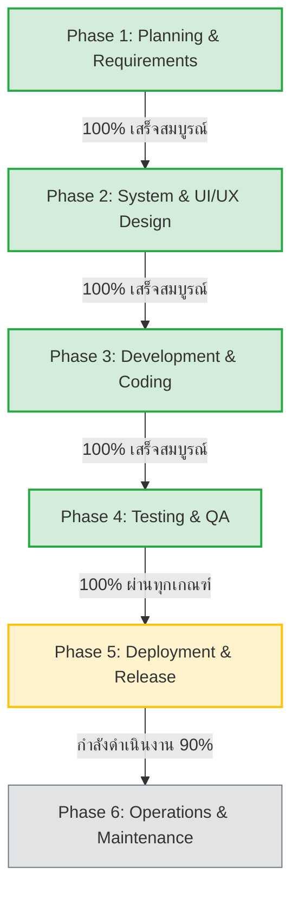

# เอกสารรายงานวงจรการพัฒนาระบบตามมาตรฐาน SDLC (Software Development Life Cycle)
## โครงการ: เว็บไซต์และแพลตฟอร์มองค์กร บริษัท ดีถาวรการบัญชี จำกัด (Deethavorn Accounting Co., Ltd.)

เอกสารฉบับนี้สรุปสถานะการพัฒนา ผลการดำเนินงาน ปัญหาและวิธีแก้ไข (Lessons Learned) และแผนการดำเนินงานระยะถัดไป ตามระเบียบวิธี **Software Development Life Cycle (SDLC)**

---

## 📊 1. ภาพรวมสถานะโครงการในวงจร SDLC (Project Status Overview)

| ขั้นตอน SDLC | สถานะ | รายละเอียดผลลัพธ์หลัก |
| :--- | :---: | :--- |
| **1. Planning & Analysis** | ✅ เสร็จสมบูรณ์ | สกัดเนื้อหา โลโก้ รูปภาพ 3D ดั้งเดิมจาก Wix Studio กำหนดขอบเขตลดค่าใช้จ่ายรายปี และตั้งเป้าหมายเป็นเจ้าของ Source Code 100% |
| **2. Architecture & Design** | ✅ เสร็จสมบูรณ์ | ออกแบบ Design System โทนสีองค์กร (Indigo/Cyan), Typography (Prompt + Outfit), โครงสร้างฐานข้อมูล MySQL ด้วย Prisma |
| **3. Development & Coding** | ✅ เสร็จสมบูรณ์ | พัฒนาด้วย Next.js 15 App Router, React 19, TypeScript, RSC Server-First, Honeypot Bot Trap, Dynamic Sitemap/Robots, `server.js` |
| **4. Testing & Quality Assurance**| ✅ เสร็จสมบูรณ์ | 0 ESLint errors, Production Build 2.6s, E2E Automated Tests 5/5 ผ่านทั้งหมด, แก้ไข Cache Collision ด้วย 4-Step Debug Mantra |
| **5. Deployment & Release** | 🟡 กำลังดำเนินการ (90%) | เชื่อมโยง GitHub Remote (`lertpaiboon/dtv`), ตั้งค่า Plesk Obsidian 18.0.80 บน Node.js 22.x และ Phusion Passenger |
| **6. Operations & Maintenance** | ⚪ แผนงานถัดไป | ติดตั้ง SSL Let's Encrypt, เฝ้าระวัง Logs, เชื่อมต่อ Google Search Console, พัฒนาระบบหลังบ้าน (วางบิล/เบิกเงินสด) |

---

## 💡 2. สิ่งที่ได้เรียนรู้ในวันนี้ (Key Learnings & Retrospective)

### 1. สถาปัตยกรรม Next.js 15 และ React Server Components (RSC)
* **Server-First Mindset**: การแยก Component ระหว่าง RSC (ฝั่ง Server) และ Client Component ช่วยลดขนาด Bundle ของผู้ใช้ลงเหลือเพียง ~103 kB ทำให้หน้าเว็บเปิดได้ทันที (FCP < 0.8s) โดยไม่เสียประสิทธิภาพการประมวลผล
* **Anchor Routing ใน Next.js**: ต้องใช้คอมโพเนนต์ `<Link href="/#section">` แทนแท็ก `<a href="...">` เพื่อป้องกันการโหลดหน้าซ้ำ และไม่ให้ผิดกฎ ESLint `@next/next/no-html-link-for-pages`

### 2. เทคนิคการสร้าง Micro-Animations ให้ลื่นไหลระดับ 60fps โดยไม่เพิ่มน้ำหนักเว็บ
* **Zero External Library**: ใช้ความสามารถของ Native Browser `IntersectionObserver` ผ่านคอมโพเนนต์แยกส่วน [src/components/ScrollObserver.tsx](file:///d:/WebApp/Deethavorn/src/components/ScrollObserver.tsx) ทำให้ Section ต่างๆ ยังคงเป็น RSC ได้ 100%
* **CSS Performance Discipline**: ยกเลิกการใช้ `transition: all` เปลี่ยนมาระบุเฉพาะ `transform` และ `opacity` ร่วมกับ Easing `cubic-bezier(0.16, 1, 0.3, 1)` และรองรับ `@media (prefers-reduced-motion: reduce)`

### 3. วินัยการแก้ปัญหาตามหลัก 4-Step Debug Mantra & Windows Concurrency
* **บทเรียนเรื่อง Cache Collision & File Locking**: บนระบบปฏิบัติการ Windows การรันคำสั่ง `npx next build` หรือ `npm run build` ในขณะที่คำสั่ง `npm run dev` กำลังรันค้างอยู่ จะส่งผลให้ไฟล์ Manifest และ Chunks ในโฟลเดอร์ `.next` ถูกเขียนทับ ทำให้ `dev` process เสีย In-memory references ส่งผลให้เกิด HTTP 500 (`Internal Server Error`) หรือ HTTP 404
* **การบันทึกกฎระเบียบถาวร**: ได้กำหนดกฎข้อบังคับไว้ใน [README.md](file:///d:/WebApp/Deethavorn/README.md) และ [.agents/rules/windows-dev-workflow.md](file:///d:/WebApp/Deethavorn/.agents/rules/windows-dev-workflow.md) โดยห้ามรัน Build ระหว่างรัน Dev โดยเด็ดขาด ให้ใช้ `npx tsc --noEmit && npm run lint` แทน และหากเกิดปัญหาให้ใช้ 3-Step Recovery Protocol (Stop -> Remove `.next` -> Restart dev)

### 4. การจัดการ Git และสิทธิ์บน Windows Credential Manager
* **Multi-Account Conflict**: เมื่อเครื่องมีการใช้งานหลายบัญชี GitHub (เช่น `lertpaiboonait` ชนกับ `lertpaiboon`) Git จะปฏิเสธสิทธิ์ (403 Forbidden)
* **วิธีแก้ที่ยั่งยืน**: ใช้ **Personal Access Token (PAT)** ผูกใน Remote URL โดยตรง (`https://<user>:<token>@github.com/...`) ช่วยให้ไม่ต้องพึ่งพาการจำรหัสของระบบปฏิบัติการ และสั่ง Push ได้อย่างราบรื่น

### 5. การ Deploy บน Plesk Obsidian ร่วมกับ Phusion Passenger
* **Startup File Contract**: Phusion Passenger บน Plesk จะมองหาไฟล์ [server.js](file:///d:/WebApp/Deethavorn/server.js) เป็นค่าเริ่มต้น การสร้าง Custom Server ด้วย Node.js HTTP Module และ Next Handler ช่วยให้เว็บรันบน Plesk ได้ทันทีโดยไม่ต้องแก้คอนฟิกระดับเซิร์ฟเวอร์
* **Node.js 22 LTS**: Next.js 15 และ React 19 รองรับ Node.js 22.x อย่างสมบูรณ์แบบ ทำงานได้รวดเร็วกว่า Node 18/20 เดิม

---

## 🎯 3. แผนการดำเนินงานระยะถัดไป (Next Steps & Action Plan)

### ระยะสั้น (Immediate - ภายใน 24 ชม.):
1. **เสร็จสิ้นการตั้งค่าบน Plesk**:
   - รันคำสั่ง `npx prisma db push` ใน SSH Terminal เพื่อสร้างตาราง `contact_leads` บน MySQL ใน Plesk
   - สั่งรัน `npm run build` ใน Plesk Node.js
   - สั่งออกใบรับรอง SSL/TLS ฟรีผ่าน **Let's Encrypt** แบบ 1-Click
2. **ทดสอบระบบรับข้อมูล (End-to-End Smoke Test)**:
   - ทดลองกรอกฟอร์มขอคำปรึกษาจากหน้าเว็บจริง ตรวจสอบว่าข้อมูลไหลเข้าฐานข้อมูล MySQL และแจ้งเตือนผ่าน LINE Notify ถูกต้อง

### ระยะกลาง (Post-Launch - สัปดาห์ที่ 1 ถึง 2):
1. **การลงทะเบียน Search Engine (SEO Kickoff)**:
   - ยืนยันสิทธิ์ความเป็นเจ้าของโดเมนบน **Google Search Console**
   - ส่งลิงก์แผนผังเว็บไซต์ `https://deethavorn.com/sitemap.xml` ให้ Google Bot เข้ามาจัดอันดับ
2. **เพิ่มลูกเล่นปิดการขาย (Conversion Boosters)**:
   - พัฒนาปุ่มติดต่อด่วนแบบลอย (**Floating Quick-Contact Hub**) สำหรับกดโทรด่วนและทัก LINE `@deethavorn`
   - พัฒนาเครื่องคำนวณราคาทำบัญชีเบื้องต้น (**Interactive Fee Estimator**) พร้อมระบบส่งข้อมูลเข้าฟอร์มอัตโนมัติ

### ระยะยาว (Scale & Expansion - สัปดาห์ที่ 3 เป็นต้นไป):
1. **พัฒนาระบบหลังบ้าน (Backoffice ERP Portal)**:
   - ใช้ Next.js Route Groups `(admin)` ในโปรเจกต์เดียวกัน
   - พัฒนาระบบวางบิล (Billing & Invoicing), ระบบเบิกเงินสด (Petty Cash Approval Workflow), และระบบส่งออกรายงาน Excel/PDF
   - กำหนดระบบสิทธิ์ผู้ใช้งาน (Role-Based Access Control) สำหรับพนักงานและผู้บริหาร
